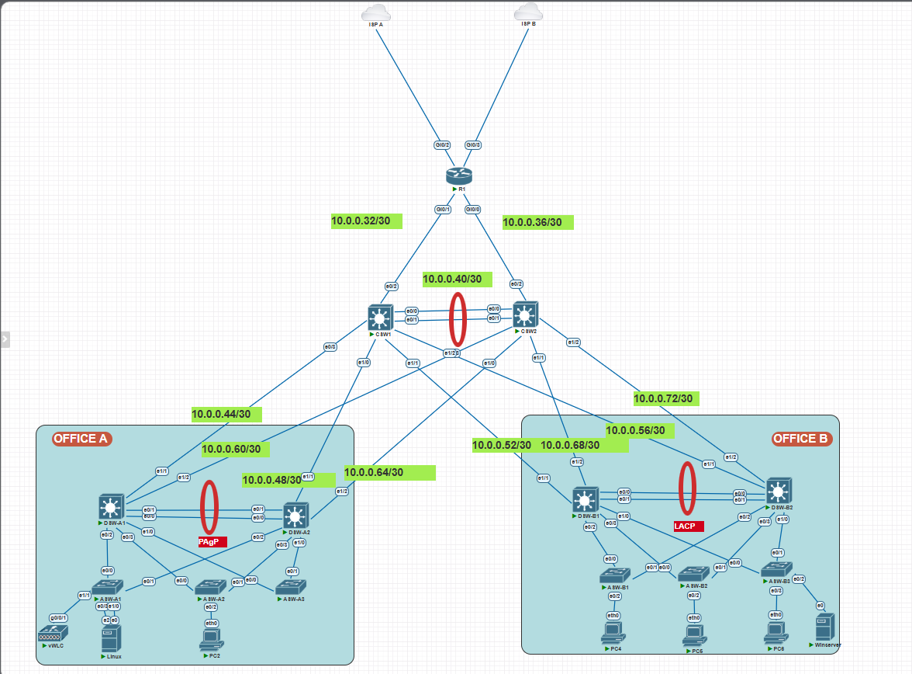

# Lab 01 — CCNA Megalab

**Author:** Sankey Silva | CCNA | JNCIA | ISC2 CC | MSc Cybersecurity  
**Platform:**   
**Reference:** [Jeremy's IT Lab — CCNA Mega Lab](https://www.youtube.com/watch?v=2p7-MluKAgE)  
**Repo:** [multi-vendor-labs](https://github.com/Sankey-nz/multi-vendor-labs)

---

## Topology



The diagram shows the virtual lab topology across Office A and Office B. Both sites connect through a shared routed core (CSW1/CSW2) and edge router (R1). Each office has a distribution pair, access switches, and end hosts. Office A includes the Cisco vWLC; Office B includes WIN-SV1 for domain, DNS, NTP, and file services. DHCP is provided by R1 in the current live configuration.

---

## Business Problem and Engineering Request

**Scenario:** SankeyLab is a fictional company operating from two offices. It needs reliable communication between sites, separate networks for users, staff/voice, servers, wireless clients, and network management, and access to shared services and the Internet. The design must include redundancy, controlled access, and a way to verify and troubleshoot failures.

**Engineering request:** Plan the IPv4 subnets and VLANs; build the routed and switched topology; configure redundancy, routing, services, security, IPv6, and wireless; then verify end-to-end connectivity and diagnose injected faults. The nine study parts break this work into manageable stages rather than isolated protocol demonstrations.

This is a virtual lab built with PNetLab and Cisco IOL/IOSv software images—not a physical hardware deployment. The images are not distributed in this repository. Configurations use Cisco IOS-style commands, while the live-state notes call out where the current virtual lab differs from the original design or from a fully validated production network.

---

## Build Requirements and Current Status

The status column describes the recorded lab configuration, not a claim that every feature has been validated with production hardware. Known live-state limitations are called out below.

| Part | Topic | Engineering task | Status | Guide |
|------|-------|----------|--------|-------|
| 1 | Initial Device Setup | Hostnames, SSH, banners, local auth, CDP/LLDP | ✅ Implemented | [P01](../obsidian-notes/P01-Initial-Setup.md) |
| 2 | VLANs & L2 EtherChannel | VLAN DB, VTP, 802.1Q trunking, PAgP EtherChannel | ✅ Implemented | [P02](../obsidian-notes/P02-VLANs-and-L2-EtherChannel.md) |
| 3 | IP Addressing & L3 EtherChannel | IPv4 scheme, SVIs, HSRP, LACP L3 EtherChannel | ⚠️ Configured; DSW-A2 user SVIs are shutdown in the recorded live state | [P03](../obsidian-notes/P03-IP-Addressing-L3-EtherChannel-HSRP.md) |
| 4 | Spanning Tree | Rapid PVST+, STP root priorities, PortFast, BPDU Guard | ✅ Implemented | [P04](../obsidian-notes/P04-Rapid-Spanning-Tree.md) |
| 5 | Routing | OSPFv2 Area 0, passive interfaces, default-information originate | ✅ Implemented | [P05](../obsidian-notes/P05-OSPF-and-Static-Routing.md) |
| 6 | Network Services | DHCP, DNS, NTP (auth), SNMP, Syslog, FTP, PAT | ✅ Implemented | [P06](../obsidian-notes/P06-Network-Services.md) |
| 7 | Security | Extended ACLs, port security, DHCP snooping, DAI | ✅ Implemented | [P07](../obsidian-notes/P07-Security.md) |
| 8 | IPv6 | Dual-stack, static IPv6 routes, IPv6 ACL | ✅ Implemented | [P08](../obsidian-notes/P08-IPv6.md) |
| 9 | Wireless | Cisco vWLC, WLAN/VLAN mapping, CAPWAP and WPA2-PSK concepts | ⚠️ WLC management configured; AP join unverified | [P09](../obsidian-notes/P09-Wireless-LAN.md) |

---

## Live Topology Notes

Deviations from the original lab design, confirmed against harvested running configs (September 2026):

- **WAN Connectivity:** R1 connects directly to ISP-B via Gi0/3 (DHCP), with `ip route 0.0.0.0 0.0.0.0 GigabitEthernet0/3 dhcp` as the default route.
- **CSW1/CSW2 are pure L3 routed core:** No SVIs, no HSRP on either core switch. All VLAN SVIs and HSRP virtual IPs live on the DSW distribution layer.
- **DSW-A2 SVIs shutdown:** Vlan10, Vlan20, and Vlan40 interfaces are administratively shutdown on DSW-A2. DSW-A1 carries all active SVI traffic for Office A. Only Vlan99 (management) is active on DSW-A2.
- **WLC1 management IP:** Live management interface is `10.0.0.7/28` on VLAN 99, connected to ASW-A1 — not `192.168.30.20/24` on VLAN 60 as originally documented.
- **DHCP hosted on R1:** All DHCP pools (A-Mgmt, A-PC, A-Phone, B-Mgmt, B-PC, Wi-Fi) run on R1, not WIN-SV1. WIN-SV1 acts as domain controller, DNS, NTP, and file server.

---

## Device Inventory

| Device | Hostname | Image | Role |
|--------|----------|-------|------|
| Edge Router | R1 | vios-adventerprisek9-m.SPA.158-3.M2 | OSPF ASBR, PAT, DHCP server, default route |
| Core L3 Switch | CSW1 | L3-IOL-15.4-2T | Pure L3 routed core — OSPF, L3 EtherChannel |
| Core L3 Switch | CSW2 | L3-IOL-15.4-2T | Pure L3 routed core — OSPF, L3 EtherChannel |
| Distribution Switch | DSW-A1 | L2-IOL-high_iron_20180510 | Office A — STP root, HSRP active (VLAN 10/99) |
| Distribution Switch | DSW-A2 | L2-IOL-high_iron_20180510 | Office A — STP secondary, HSRP active (VLAN 20/40) |
| Distribution Switch | DSW-B1 | L2-IOL-high_iron_20180510 | Office B — STP root, HSRP active (VLAN 10/99) |
| Distribution Switch | DSW-B2 | L2-IOL-high_iron_20180510 | Office B — STP secondary, HSRP active (VLAN 20/30) |
| Access Switch | ASW-A1 | L2-IOL-15.2d | Office A — PC1, WLC1 uplink |
| Access Switch | ASW-A2 | L2-IOL-15.2d | Office A — PC2 |
| Access Switch | ASW-A3 | L2-IOL-15.2d | Office A — PC3 |
| Access Switch | ASW-B1 | L2-IOL-15.2d | Office B — PC4 |
| Access Switch | ASW-B2 | L2-IOL-15.2d | Office B — PC5 |
| Access Switch | ASW-B3 | L2-IOL-15.2d | Office B — PC6, WIN-SV1 |
| Wireless LAN Controller | WLC1 | vwlc-8.7.102 | WLAN management (10.0.0.7/28, VLAN 99) |
| Windows Server | WIN-SV1 | winserver-S2008-R2-x64 | AD/DC, DNS, NTP, FTP (10.5.0.4, VLAN 30) |
| Management Host | Kali | Kali Linux | Management access, fault injection, packet capture |

---

## Skills Demonstrated

| Domain | Technologies |
|--------|-------------|
| Routing | OSPFv2 Area 0, passive interfaces, `default-information originate`, static routes, PAT/NAT overload |
| Switching | VLANs, 802.1Q trunking, VTP, Rapid PVST+, EtherChannel (LACP + PAgP), L2 and L3 channels |
| Redundancy | HSRP active/standby per VLAN group across DSW distribution pairs |
| Security | Extended ACLs (named), port security (sticky MAC), DHCP snooping, Dynamic ARP Inspection, SSHv2 |
| Network Services | DHCP relay (`ip helper-address`), DNS, NTP with authentication, SNMP v2c, Syslog, FTP |
| IPv6 | Dual-stack addressing (EUI-64), static IPv6 routing, IPv6 ACL |
| Wireless | Cisco vWLC 8.7, WLAN/VLAN mapping, CAPWAP concepts, WPA2-PSK |
| Troubleshooting | Structured fault injection (8 faults across L2/L3/Security), OSI-layer isolation methodology |

---

## Repository Structure

```
multi-vendor-labs/
├── README.md
└── labs/
    ├── obsidian-notes/              ← per-part study notes (P01–P09)
    └── lab01-ccna-megalab/
        ├── README.md                ← this file
        ├── addressing-table.md      ← live-verified IP addressing
        ├── LAB-STATE.md             ← current lab state and access notes
        ├── topology/
        │   └── topology.png
        ├── configs/                 ← 13 device running configs (live harvested)
        │   ├── R1.txt
        │   ├── CSW1.txt  CSW2.txt
        │   ├── DSW-A1.txt  DSW-A2.txt  DSW-B1.txt  DSW-B2.txt
        │   └── ASW-A1.txt  ASW-A2.txt  ASW-A3.txt
        │       ASW-B1.txt  ASW-B2.txt  ASW-B3.txt
        └── scripts/
            ├── harvest/             ← Netmiko config collection scripts
            └── troubleshooting/     ← SSH and connectivity test scripts
```

---

## References

- [Jeremy's IT Lab — CCNA Mega Lab](https://www.youtube.com/watch?v=2p7-MluKAgE)
- [PNetLab Documentation](https://pnetlab.com/pages/documentation)
- [Cisco IOS Configuration Guides](https://www.cisco.com/c/en/us/support/index.html)

---

*Built as part of the [multi-vendor-labs](https://github.com/Sankey-nz/multi-vendor-labs) portfolio by Sankey Silva — Auckland, NZ.*
